## Quick setup
The website is deployed with vercel, via the url: https://tdt-4140-prosjekt-jov2.vercel.app/login
To get all the different features on the website, the logged in user needs to be an admin account. An Admin account has already been created for you. Email: admin@user.com Password: adminuser
## How to launch
### Install npm
```bash
npm install
```
### Add .env.local file
Add a .env.local file in the root folder. This file needs to have values: 
```bash
NEXT_PUBLIC_SUPABASE_URL=https://aliuymbietvlamisfkhj.supabase.co
NEXT_PUBLIC_SUPABASE_PUBLISHABLE_DEFAULT_KEY=sb_publishable_PUvJCGDbSDSfJ7gdUuxUmQ_ZX7CLyT3
```
### Launching the project locally
```bash
npm run dev
```
### Visiting the website
To use the website go to http://localhost:3000/
You can log in with the same admin account as detailed above, or create a new account if you do not want admin features.
## Module Setup
### App
-  The app folder has folders for each page. This is used to import a component and display it as a page.
### Components
- The component folder includes files for different parts of the page. The components defines the visuals of a certain page and how it behaves based on User Interaction.
### lib
- The lib folder contains logic and functions that aren't direclty UI. This is currently used for Business Logic, API calls, database operations and user authentication.  
## Screen Shots

### Log In Page
Log in page allowing the user to log in, or register if they dont already have an account

### Register Page
Register page allowing users to create an account.


### Home Page
Home page where you can view all upcoming competitions that you are participating in. 
You can also click on the competitions which will lead you to the detail page.
There is also a search function that allows you to search and view other user profiles.
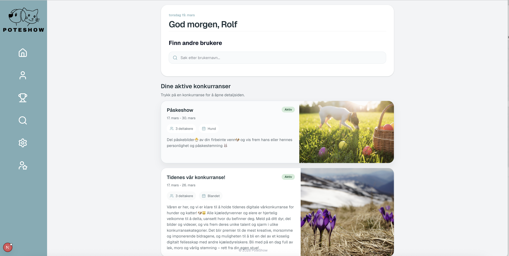
New post button allows user to post an image into a competition.
### Profile page
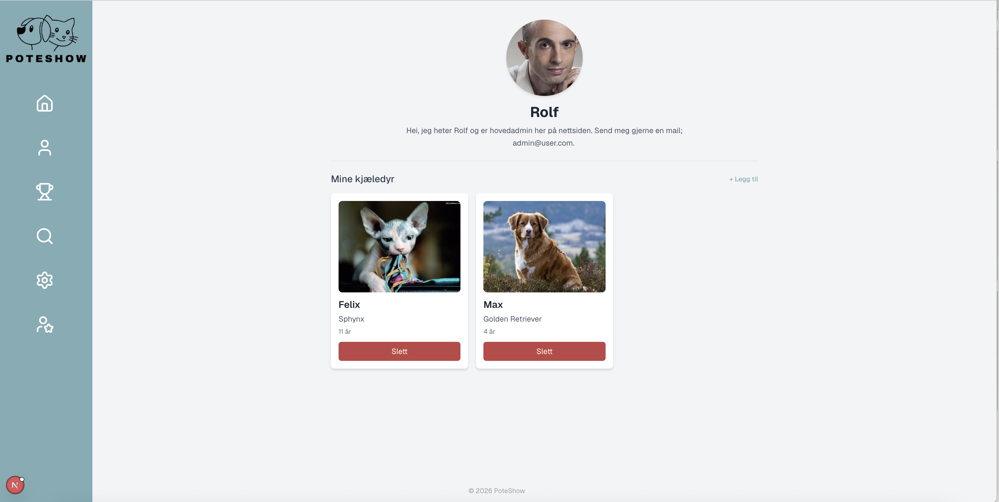
Profile page displaying users profile picture, bio and their animals
Pressing legg til text allows user to add another animal to their profile.
### Competitions page
The competititons shows all active, upcoming and finished competitions. If the user is an admin they can create competitions.
You can also click on each competitions and view competitors. The page also allows administrators to moderate content.
Users are also allowed to comment and like posts in competitions they are apart of.
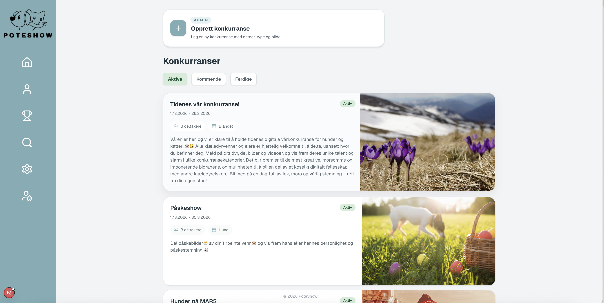
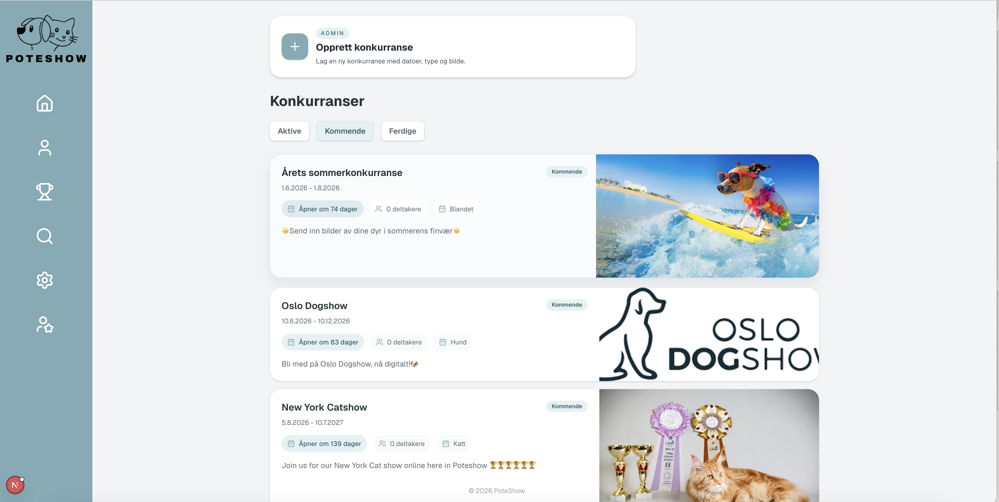
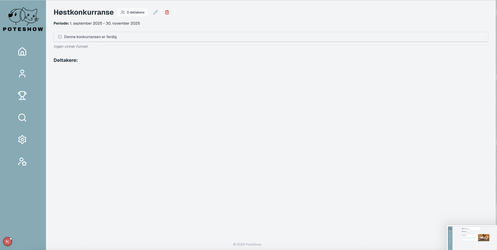
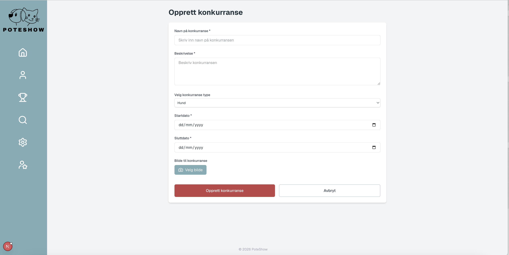

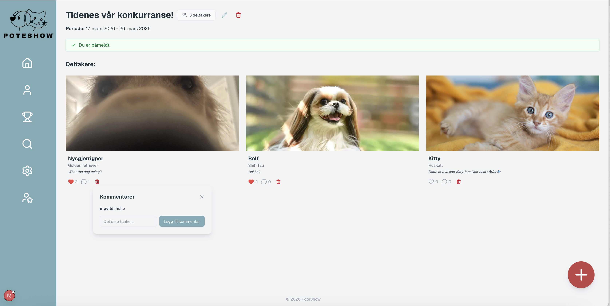
###  Search page
The search page allows users to search up other profiles and view their pages.
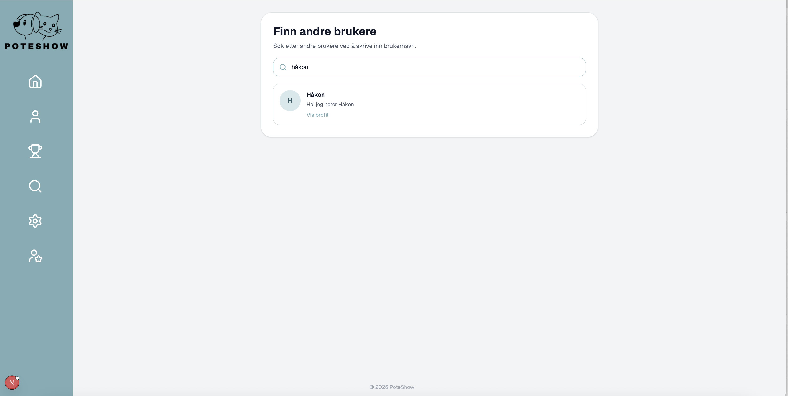
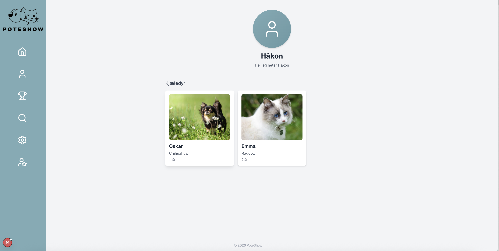
### Settings page
The settings page allows the user to change their profile picture, name, bio and password.
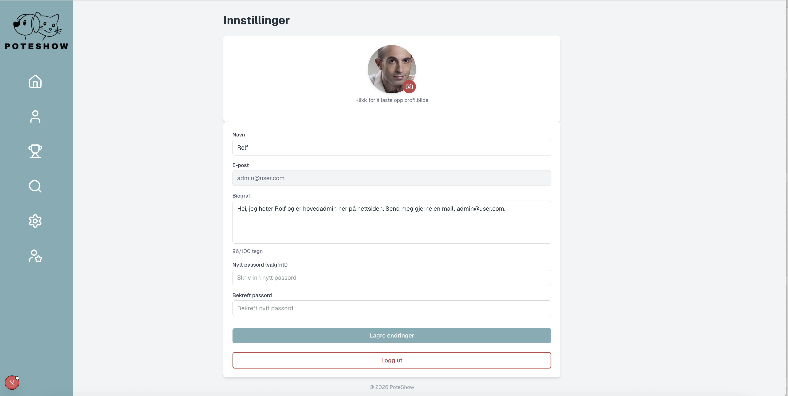
### Admin page
The administrator page shows relevant statistics about the website. This includes users made over time, competitions over time and the most popular account by likes.
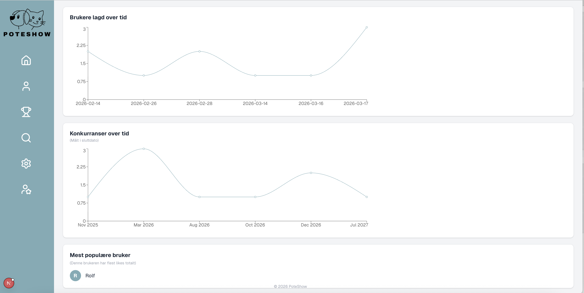
### Sidebar
The sidebar shows available pages.
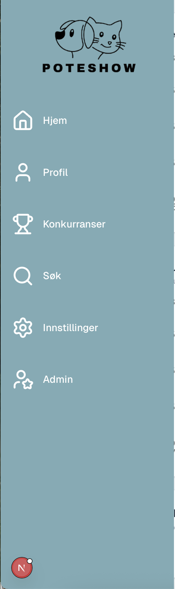